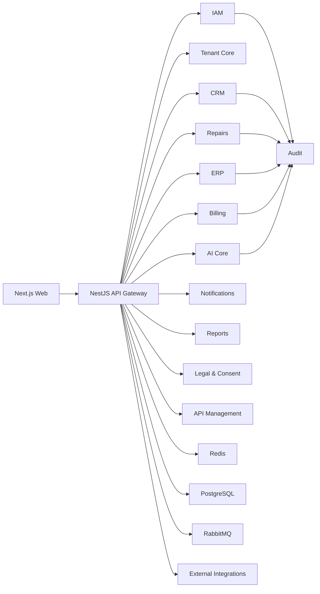
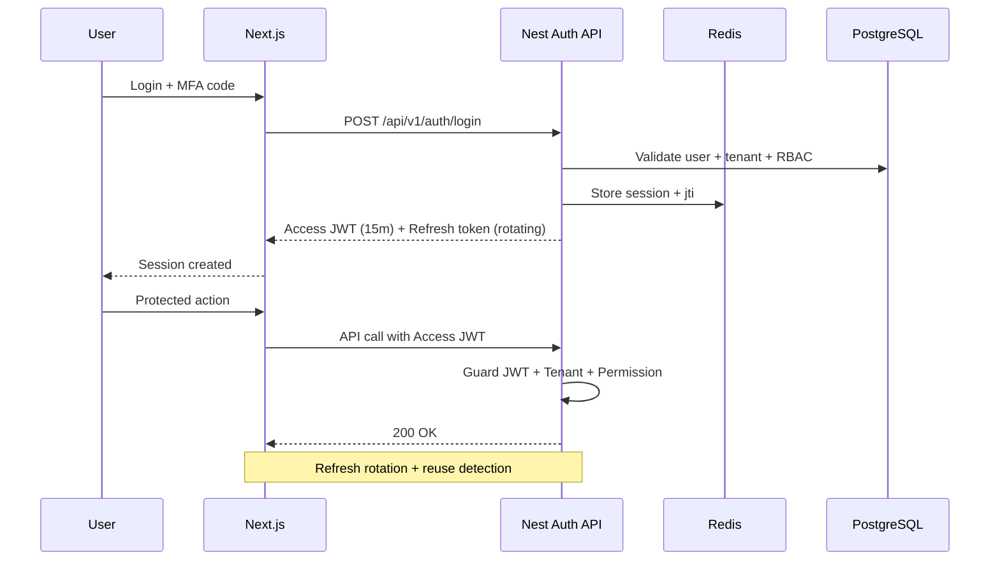

# Target Architecture V2 (Next.js + NestJS)

Fecha: 2026-06-27  
Estado: Propuesta ejecutable (Enterprise Blueprint)  
Owner: CTO / Tech Lead / Platform Team

## 0. Objetivo y alcance

Disenar la plataforma IAtechs Pro V2 como SaaS Enterprise multi-tenant, escalable, segura y mantenible, usando:

- Frontend: Next.js + TypeScript + TailwindCSS
- Backend: NestJS + TypeScript
- Data: PostgreSQL + Prisma
- Cache: Redis
- Mensajeria: RabbitMQ (fase 1) con camino a Kafka (fase 2)
- Infra: Docker + Kubernetes + Terraform + GitHub Actions

El enfoque es:

- Fase 1: Modular Monolith con DDD + Clean Architecture + CQRS + Event Driven
- Fase 2: Extraccion progresiva a microservicios por bounded context

## 1. Estructura completa de carpetas

```text
platform-v2/
|-- apps/
|   |-- web/                                  # Next.js (App Router)
|   |   |-- src/
|   |   |   |-- app/                          # Routing, layouts, auth guards
|   |   |   |-- modules/                      # Modulos UI por dominio
|   |   |   |   |-- dashboard/
|   |   |   |   |-- crm/
|   |   |   |   |-- erp/
|   |   |   |   |-- repairs/
|   |   |   |   |-- inventory/
|   |   |   |   |-- billing/
|   |   |   |   |-- users/
|   |   |   |   |-- iam/
|   |   |   |   |-- settings/
|   |   |   |   |-- ai/
|   |   |   |   |-- integrations/
|   |   |   |   |-- reports/
|   |   |   |   |-- audit/
|   |   |   |   |-- api-management/
|   |   |   |   |-- notifications/
|   |   |   |   |-- legal/
|   |   |   |   |-- consent/
|   |   |   |   |-- help-center/
|   |   |   |   `-- docs-center/
|   |   |   |-- shared/
|   |   |   |   |-- ui/                       # Design system reusable
|   |   |   |   |-- hooks/
|   |   |   |   |-- lib/
|   |   |   |   |-- services/
|   |   |   |   `-- types/
|   |   |   `-- middleware.ts
|   |   |-- tests/
|   |   `-- package.json
|   |-- api/                                  # NestJS Modular Monolith
|   |   |-- src/
|   |   |   |-- main.ts
|   |   |   |-- app.module.ts
|   |   |   |-- shared/
|   |   |   |   |-- kernel/                   # Bus, base abstractions, result types
|   |   |   |   |-- auth/                     # JWT, refresh, MFA, guards
|   |   |   |   |-- tenant/                   # Tenant resolver, policies, interceptors
|   |   |   |   |-- audit/
|   |   |   |   |-- observability/
|   |   |   |   |-- cache/
|   |   |   |   |-- messaging/
|   |   |   |   `-- errors/
|   |   |   `-- modules/
|   |   |       |-- dashboard/
|   |   |       |-- crm/
|   |   |       |-- erp/
|   |   |       |-- repairs/
|   |   |       |-- inventory/
|   |   |       |-- billing/
|   |   |       |-- users/
|   |   |       |-- iam/
|   |   |       |-- settings/
|   |   |       |-- ai/
|   |   |       |-- integrations/
|   |   |       |-- reports/
|   |   |       |-- audit/
|   |   |       |-- api-management/
|   |   |       |-- notifications/
|   |   |       |-- legal/
|   |   |       |-- consent/
|   |   |       |-- help-center/
|   |   |       `-- docs-center/
|   |   |-- prisma/
|   |   |   |-- schema.prisma
|   |   |   |-- migrations/
|   |   |   `-- seed/
|   |   |-- test/
|   |   `-- package.json
|   `-- worker/                               # Procesos async / eventos / jobs
|       |-- src/
|       |-- test/
|       `-- package.json
|-- packages/
|   |-- contracts/                            # OpenAPI types, DTO contracts
|   |-- eslint-config/
|   |-- tsconfig/
|   |-- ui/                                   # Design system shared
|   `-- sdk/                                  # Client SDK interno
|-- infra/
|   |-- terraform/
|   |   |-- modules/
|   |   |   |-- network/
|   |   |   |-- eks/
|   |   |   |-- rds/
|   |   |   |-- redis/
|   |   |   |-- rabbitmq/
|   |   |   |-- observability/
|   |   |   |-- security/
|   |   |   `-- cdn-waf/
|   |   `-- envs/
|   |       |-- dev/
|   |       |-- staging/
|   |       `-- prod/
|   |-- k8s/
|   |   |-- base/
|   |   `-- overlays/
|   |       |-- dev/
|   |       |-- staging/
|   |       `-- prod/
|   `-- docker/
|       |-- web.Dockerfile
|       |-- api.Dockerfile
|       `-- worker.Dockerfile
|-- .github/
|   `-- workflows/
|       |-- ci.yml
|       |-- cd-staging.yml
|       |-- cd-prod.yml
|       `-- security.yml
|-- docs/
|   |-- architecture/
|   |-- api/
|   |-- runbooks/
|   |-- adr/
|   `-- quality/
|-- turbo.json
|-- pnpm-workspace.yaml
|-- package.json
`-- README.md
```

## 2. Arquitectura DDD completa

Bounded Contexts principales:

1. IAM (usuarios, roles, permisos, MFA, sesiones)
2. Tenant Management (empresas, planes, suscripciones)
3. CRM (clientes, leads, oportunidades, interacciones)
4. Repairs (tickets, diagnostico, ordenes, garantias)
5. ERP Core (inventario, compras, ventas, proveedores, finanzas)
6. Billing (facturacion, pagos, impuestos, conciliacion)
7. AI Core (prompts, conversaciones, clasificacion, prediccion)
8. Notifications (in-app, email, whatsapp, webhooks)
9. Reporting & BI (KPIs, exportables, consumo API)
10. Legal & Compliance (T&C, privacidad, consentimientos, auditoria)
11. API Management (keys, quotas, webhooks, usage)

Estructura interna por modulo (Clean Architecture):

```text
module/
|-- domain/              # Entidades, value objects, eventos, reglas
|-- application/         # Use cases CQRS, handlers, DTOs, ports
|-- infrastructure/      # Prisma repos, adapters externos, cache, bus
`-- presentation/        # Controllers REST, ws gateways, mappers
```

Principios no negociables:

- SOLID en servicios y casos de uso
- CQRS: comandos y queries separados
- Domain Events + Integration Events
- Outbox Pattern para consistencia entre BD y bus
- Dependencias hacia adentro (infra depende de application/domain)

## 3. Diseno de Base de Datos (PostgreSQL + Prisma)

Modelo multi-tenant:

1. Tenant compartido por schema (shared schema) con `tenant_id` obligatorio.
2. Row Level Security (RLS) por `tenant_id`.
3. Opcion enterprise para tenant dedicado (database-per-tenant) en fase 3.

Convenciones de tablas:

- PK: `id` UUID
- Tenant key: `tenant_id` UUID
- Soft delete: `deleted_at`
- Auditoria: `created_by`, `updated_by`, `deleted_by`
- Concurrencia: `version` (optimistic locking)

Tablas nucleares:

1. IAM: `users`, `roles`, `permissions`, `user_roles`, `role_permissions`, `refresh_tokens`, `mfa_factors`, `sessions`
2. Tenant: `tenants`, `tenant_domains`, `subscriptions`, `plans`, `tenant_settings`
3. CRM: `customers`, `leads`, `opportunities`, `pipelines`, `pipeline_stages`, `interactions`
4. Repairs: `devices`, `repair_orders`, `diagnostics`, `repair_steps`, `repair_assets`, `repair_photos`, `signatures`, `warranties`
5. ERP: `products`, `warehouses`, `stock_items`, `stock_movements`, `suppliers`, `purchase_orders`, `sales_orders`, `journal_entries`
6. Billing: `invoices`, `invoice_items`, `payments`, `refunds`, `tax_rules`
7. AI: `ai_providers`, `ai_prompt_templates`, `ai_prompt_versions`, `ai_conversations`, `ai_messages`, `ai_predictions`
8. Integrations: `integration_accounts`, `webhook_subscriptions`, `webhook_deliveries`, `oauth_connections`
9. Platform: `notifications`, `notification_preferences`, `audit_logs`, `api_keys`, `api_usage_daily`, `report_jobs`
10. Legal: `legal_documents`, `policy_versions`, `consent_records`, `terms_acceptances`
11. Knowledge: `help_articles`, `help_categories`, `doc_pages`

Optimizacion:

1. Indices compuestos: `(tenant_id, status, created_at DESC)` en tablas operativas.
2. Particion mensual: `audit_logs`, `api_usage_daily`, `notifications`, `ai_messages`.
3. Read replicas para queries de reportes.
4. Pooling con PgBouncer.

## 4. Casos de uso (nivel enterprise)

Casos criticos por dominio:

1. Auth: login, refresh, MFA challenge, revoke session, password reset.
2. Tenant: alta de empresa, asignacion de plan, suspension y reactivacion.
3. CRM: crear lead, mover etapa, convertir a cliente, registrar interaccion.
4. Repairs: crear orden, diagnostico, asignar tecnico, ejecutar reparacion, cierre con firma.
5. ERP: ingreso de inventario, transferencia entre bodegas, compra a proveedor, ajuste de stock.
6. Billing: emitir factura, aplicar pago, reintento, conciliacion y reporte tributario.
7. AI: clasificar ticket, resumir diagnostico, recomendar repuestos, responder asistente virtual.
8. Notifications: publicar evento realtime, email transactional, whatsapp status update.
9. Reports: generar export PDF/CSV/XLSX y distribuir por permiso.
10. Compliance: versionar terminos, registrar consentimiento, trazabilidad legal.

## 5. Diseno de APIs (REST + WebSockets + OpenAPI)

Contrato base:

- Base path: `/api/v1`
- Auth: bearer JWT + refresh token rotation
- OpenAPI generado desde decorators Nest
- Error envelope estandarizado

Namespaces API:

1. `/api/v1/auth/*`
2. `/api/v1/tenants/*`
3. `/api/v1/users/*`
4. `/api/v1/crm/*`
5. `/api/v1/repairs/*`
6. `/api/v1/erp/*`
7. `/api/v1/billing/*`
8. `/api/v1/ai/*`
9. `/api/v1/integrations/*`
10. `/api/v1/reports/*`
11. `/api/v1/audit/*`
12. `/api/v1/api-management/*`
13. `/api/v1/notifications/*`
14. `/api/v1/legal/*`
15. `/api/v1/help-center/*`
16. `/api/v1/docs/*`

Realtime:

- WS namespace: `/ws/tenant/{tenantId}`
- Channels: dashboard metrics, notifications, order status, SLA alerts
- Autorizacion por JWT + tenant context + permisos

## 6. Diagramas de modulos



## 7. Flujo de autenticacion



## 8. Estrategia de cache (Redis)

Capas:

1. Query cache por tenant para dashboards y listados de alta lectura.
2. Session store distribuido.
3. Rate limiting (IP + user + tenant + endpoint).
4. Pub/Sub para eventos realtime.

Reglas de invalidacion:

1. Event-driven invalidation por domain event.
2. Versioned keys para permisos y configuracion (`v{stamp}`).
3. TTL corto en dashboards (15s-60s), medio en catalogos (5m-30m), largo en metadata (12h).

Ejemplos de keys:

- `tenant:{id}:dashboard:summary`
- `tenant:{id}:inventory:stock:{sku}`
- `tenant:{id}:crm:pipeline:{id}`
- `user:{id}:permissions:v{stamp}`
- `tenant:{id}:api-usage:{date}`

## 9. Estrategia de escalabilidad

1. API y web stateless para escalado horizontal.
2. HPA en Kubernetes por CPU, memoria y latency P95.
3. Read replicas PostgreSQL para queries pesadas.
4. Worker autoscaling por backlog de colas.
5. CDN para assets estaticos y contenido publico.
6. Partitioning y archiving para tablas de alto volumen.
7. Circuit breakers y retries exponenciales en integraciones.
8. Sagas para procesos largos (billing, integrations, AI jobs).

## 10. Estrategia de seguridad

1. JWT corto + refresh rotativo + deteccion de replay.
2. MFA obligatorio por politicas de riesgo.
3. RBAC granular y politicas por tenant.
4. Encrypt-at-rest (RDS KMS) y encrypt-in-transit (TLS 1.2+).
5. Secret management centralizado (AWS Secrets Manager).
6. OWASP ASVS + headers + CSP + CSRF + input validation.
7. Auditoria inmutable para acciones sensibles.
8. WAF + Bot protection + DDoS shield.
9. Data masking para PII en logs y observabilidad.
10. SAST + DAST + SCA + secret scanning en pipeline.

## 11. Pipeline CI/CD (GitHub Actions)

Pipeline objetivo:

1. `ci.yml`: lint, typecheck, unit tests, integration tests, contract tests, build.
2. `security.yml`: SAST, SCA, secret scan, container scan, IaC scan.
3. `cd-staging.yml`: build image, push registry, deploy k8s staging, smoke tests.
4. `cd-prod.yml`: deploy canary, synthetic tests, progressive rollout, auto rollback.

Reglas de calidad:

1. Cobertura minima backend 85%, frontend 80%.
2. Bloqueo de merge con fallas de seguridad High/Critical.
3. ADR obligatoria para cambios de stack o contrato.

## 12. Infraestructura Cloud (AWS reference)

Servicios:

1. VPC multi-AZ con subnets publicas/privadas.
2. EKS para web/api/worker.
3. RDS PostgreSQL Multi-AZ + replicas.
4. ElastiCache Redis cluster mode enabled.
5. RabbitMQ administrado (Amazon MQ) en fase 1.
6. S3 + CloudFront para archivos y reportes.
7. ALB + WAF + ACM TLS.
8. ECR para imagenes Docker.
9. Sentry para errores app.
10. Prometheus + Grafana para metricas.
11. OpenSearch/CloudWatch para logs centralizados.

Terraform:

1. Modulos reutilizables por capa.
2. Estados remotos cifrados y bloqueados.
3. Plan/apply por ambiente con aprobaciones.

## 13. Convenciones de codigo

1. TypeScript strict mode obligatorio.
2. ESLint + Prettier + import ordering.
3. Conventional Commits.
4. Arquitectura por dominio, no por tecnologia.
5. DTOs para contratos externos, entities para dominio.
6. Prohibido acceso directo a infraestructura desde presentation.
7. Cada modulo con README tecnico y diagrama.
8. PR template obligatorio con riesgos, pruebas y migracion.

## 14. Estrategia de pruebas

1. Unit tests: casos de uso, domain services, mappers.
2. Integration tests: repositorios Prisma + Redis + RabbitMQ con Testcontainers.
3. API tests: contratos OpenAPI y regresion de seguridad.
4. E2E: flujos criticos de negocio con Playwright.
5. Performance: k6 para picos de concurrencia.
6. Chaos tests: caida de Redis/Rabbit/replica para validar resiliencia.
7. Security tests: OWASP ZAP + auth abuse tests.

Matriz minima por release:

1. Auth + tenant isolation.
2. CRM pipeline end-to-end.
3. Repair order end-to-end.
4. Invoice + payment end-to-end.
5. AI ticket classification + assistant response.
6. Notifications realtime + fallback async.

## 15. Documentacion tecnica obligatoria

Pack V2 minimo:

1. `docs/architecture/v2/*` (contexto, modulos, NFR, escalabilidad)
2. `docs/api/v2/*` (OpenAPI, examples, webhooks)
3. `docs/runbooks/*` (deploy, rollback, incidentes, backup, DR)
4. `docs/adr/*` (decisiones de alto impacto)
5. `docs/quality/*` (quality gates, SLO/SLA, testing matrix)

Politica documental:

1. Ningun modulo se considera terminado sin doc + pruebas + observabilidad.
2. Cada release exige actualizacion de changelog tecnico y runbook.

## Modulos obligatorios cubiertos

1. Dashboard
2. CRM
3. ERP
4. Reparaciones
5. Inventario
6. Facturacion
7. Usuarios
8. Roles y Permisos
9. Configuracion
10. IA
11. Integraciones
12. Reportes
13. Auditoria
14. API Management
15. Centro de Notificaciones
16. Terminos y Condiciones
17. Politica de Privacidad
18. Gestion de Consentimientos
19. Centro de Ayuda
20. Documentacion

## Fases de ejecucion recomendadas

1. Fase A: Fundaciones V2 (monorepo, auth, tenant, observabilidad, CI/CD).
2. Fase B: Core operativo (CRM + Repairs + Inventory + Billing + Notifications).
3. Fase C: IA Enterprise + API Management + Integraciones externas.
4. Fase D: Escala masiva, hardening, microservicios selectivos.

## KPIs tecnicos objetivo (produccion)

1. Availability API: 99.95%
2. P95 latency lectura: < 250ms
3. P95 latency escritura: < 400ms
4. Error rate 5xx: < 0.2%
5. MTTR incidente severo: < 30 min
6. RPO: <= 5 min
7. RTO: <= 30 min
